# Open Prose

A small native app for writing your blog and shipping it as your own static site. No cloud, no accounts — your posts live in a file on your computer, and one click turns them into a real website.

## Stack

- **Wails v2** — Go backend + WebView frontend; ships as a native binary.
- **Go** + **modernc.org/sqlite** — pure-Go SQLite driver.
- **TanStack Router** + **TanStack Query** — file-based routing and server-state.
- **Plate.js** — the rich-text editor.
- **Next.js 16** + **MDX** + **sharp** + **next/font/google** — exported sites.
- **Pagefind** — static, client-side full-text search baked into every export.
- **rehype-highlight** + **rehype-unwrap-images** + **remark-gfm** — MDX pipeline.
- **Tailwind v4** (CSS-first via `@theme inline`).

## How it's built

Two diagrams — the layered view, and what happens when you click **Export**.

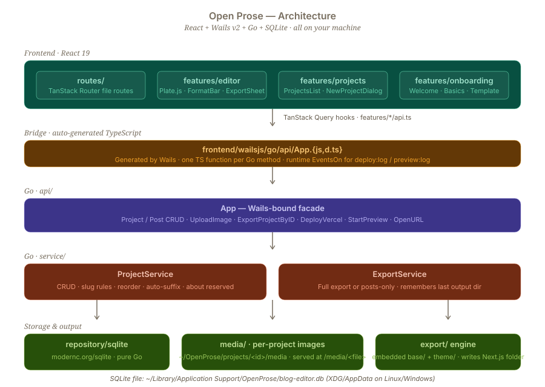

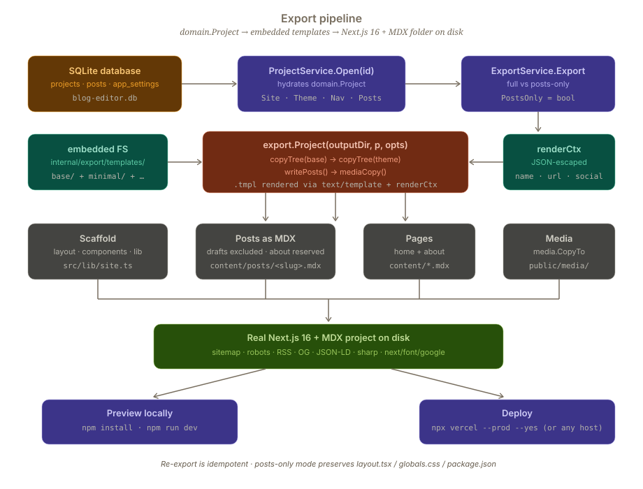

## Screenshots

### In the app

|  |  |
|---|---|
| **Pick a site** | **Write a post** |
| 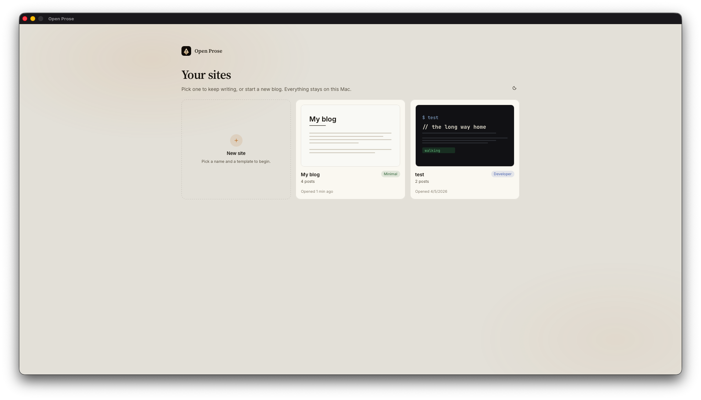 | 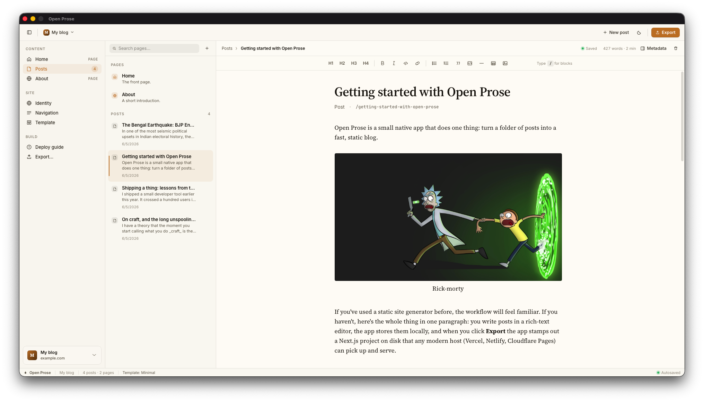 |
| **Edit the home page** | **Drop in an image** |
| 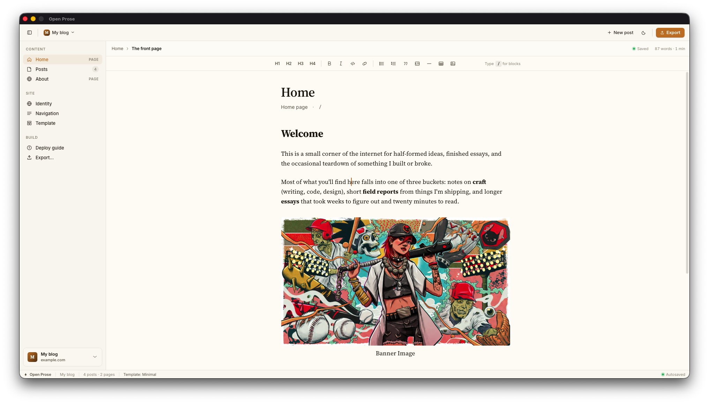 | 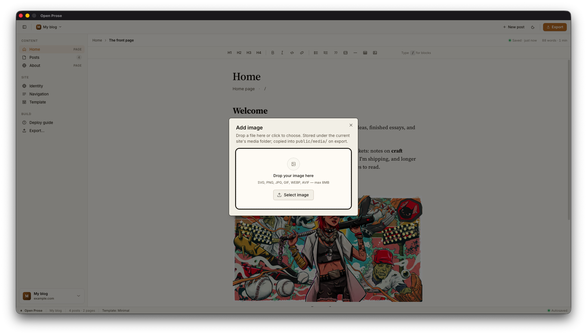 |
| **Site identity & SEO** | **Pick a template** |
| 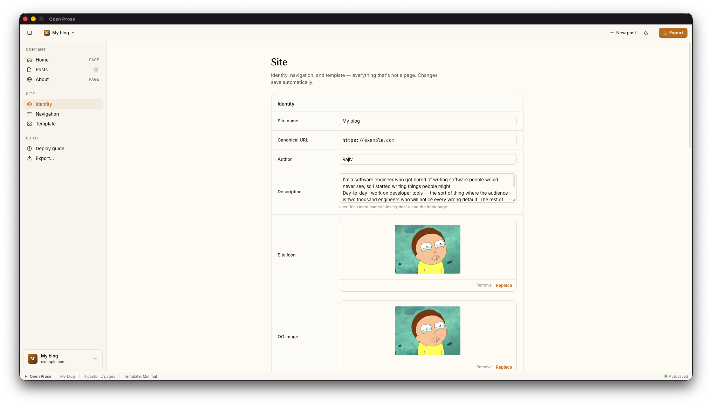 | 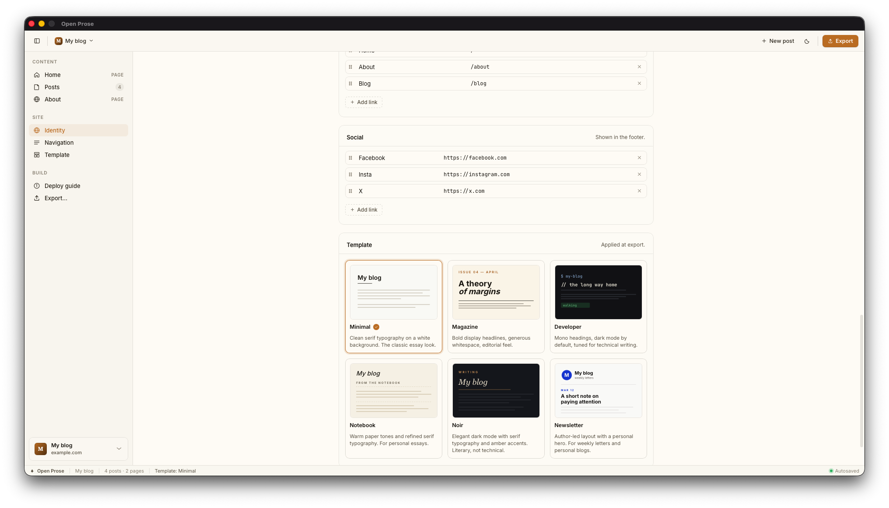 |
| **Export dialog** | **Deploy guide** |
| 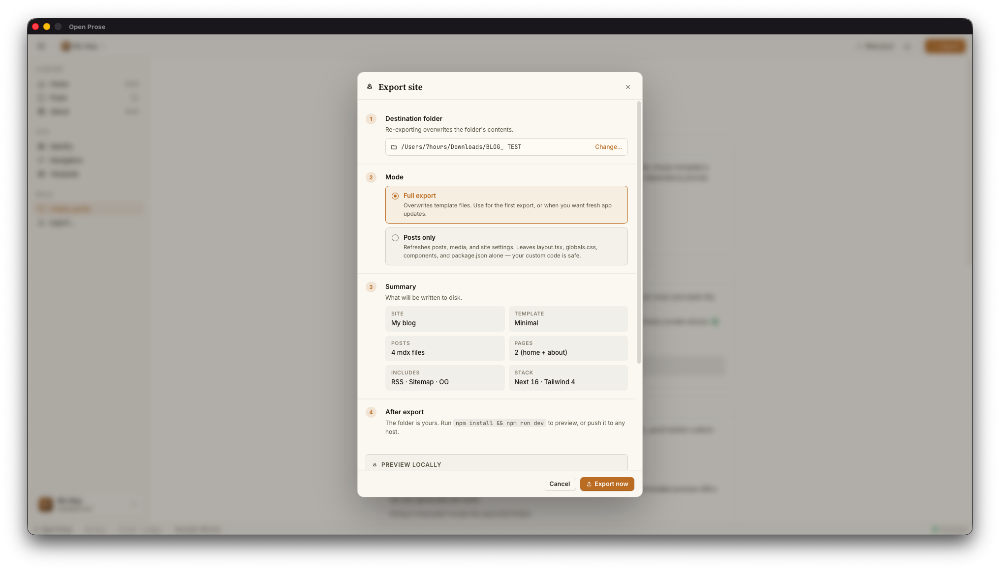 | 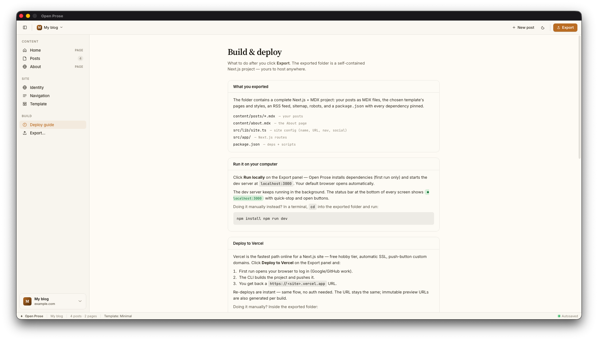 |

### The exported site

|  |  |
|---|---|
| **Home** | **Blog index** |
| 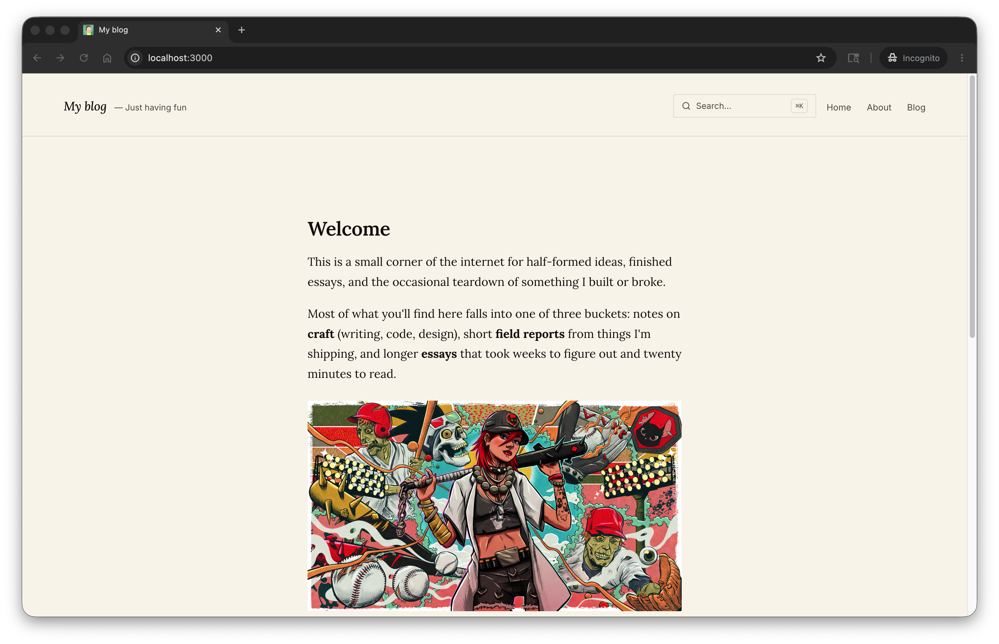 | 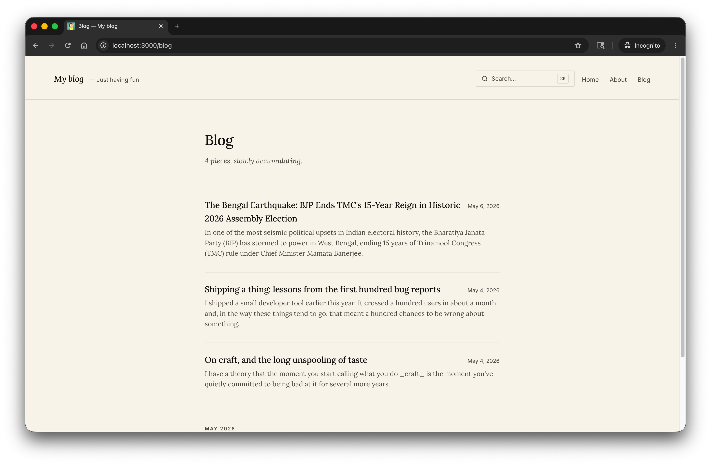 |
| **Post** | **About** |
| 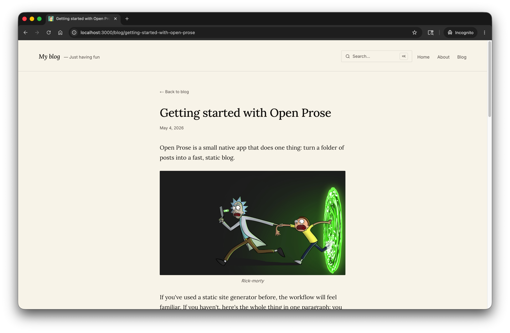 | 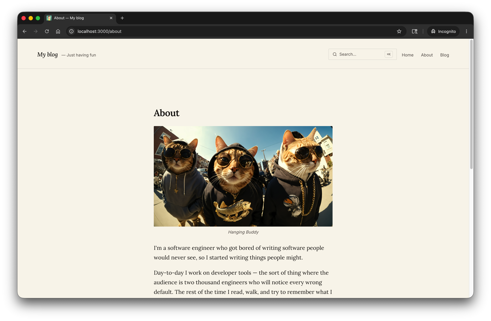 |
| **⌘K search — home** | **⌘K search — inside a post** |
| 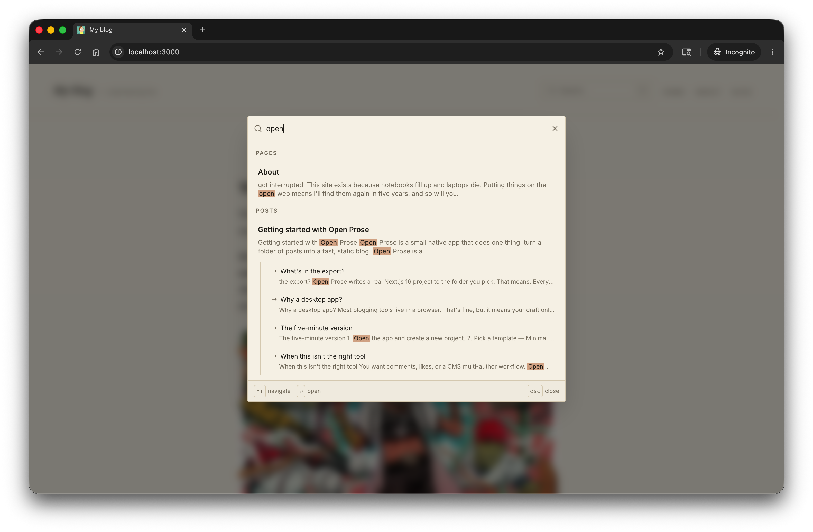 | 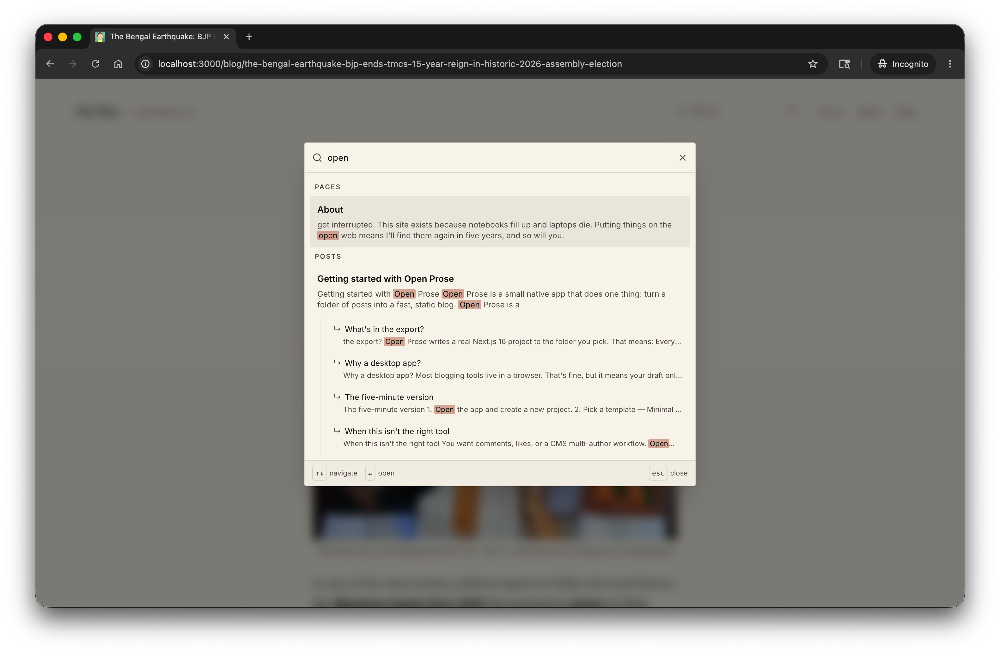 |

## What it is

Open Prose is a desktop app for **macOS** and **Windows** that pairs a rich-text editor with an export pipeline. You write in the app, click **Export** to stamp out a real Next.js 16 + MDX project on disk, and click **Deploy** to ship it to Vercel via the official CLI.

The SQLite database, the uploaded media, and the configuration all live in a folder on your computer.

## The loop

1. **Write** — rich-text editor (Plate.js) with markdown, MDX, images, code blocks, tables, and a slash menu.
2. **Store** — content lands in a single SQLite file under your app data directory.
3. **Export** — a Go engine renders the SQLite content into a real Next.js 16 + MDX project on disk. You own that folder.
4. **Own** — the exported project ships with sitemap, robots, RSS, JSON-LD, image optimization (`next/image` + `sharp`), self-hosted fonts (`next/font/google`), a built-in **Pagefind** search index, and a responsive template.
5. **Publish** — click Deploy to push to Vercel, or hand the folder to Netlify, Cloudflare Pages, GitHub Pages (with `output: "export"`), or any Node host.

## Search — Pagefind

Every exported site ships with **[Pagefind](https://pagefind.app/)** wired up out of the box:

- A static search index is built at `npm run build` time and shipped as files under `public/pagefind/`.
- Open the **⌘K** command palette anywhere on the site to search across pages and posts.
- Heading-level sub-results jump straight to a section inside a long post.

The search bar is wired into the site header (desktop) and the mobile hamburger drawer, so it's always one keystroke away.

## Templates

Out of the box, each with its own typography and color story:

| Template | One-liner |
|----------|-----------|
| **Minimal** | A serif-led, single-column blog. For essays. |
| **Magazine** | An editorial layout with a large display face. For longer features. |
| **Developer** | A monospace, terminal-flavoured layout. For technical posts. |
| **Notebook** | Warm paper feel, generous margins. For personal notes. |
| **Noir** | High-contrast dark mode, typographic and quiet. For technical writing. |
| **Newsletter** | Author-led layout with a personal voice. For short-form posts. |

Switch templates anytime — the content is portable.

## Data ownership

Your content lives at:

| OS | Path |
|----|------|
| **macOS** | `~/Library/Application Support/OpenProse/blog-editor.db` |
| **Windows** | `%APPDATA%\OpenProse\blog-editor.db` |
| **Linux** | `$XDG_CONFIG_HOME/OpenProse/blog-editor.db` |

Plus a `media/` subfolder for uploaded images.

Exported projects are conventional Next.js 16 projects. Open them in any editor; the structure is documented in the export's own README at [`internal/export/templates/base/README.md.tmpl`](internal/export/templates/base/README.md.tmpl).

## Run locally

Requires **Go 1.21+**, **Node 20+**, and the [Wails CLI](https://wails.io/docs/gettingstarted/installation).

```bash
git clone <repo-url> open-prose
cd open-prose
wails dev
```

A native window pops up. The frontend hot-reloads; Go changes require a restart.

## Build

Native build for the current platform:

```bash
wails build -clean -skipbindings
# → build/bin/openprose.app   (macOS)
# → build/bin/openprose.exe   (Windows / Linux)
```

Cross-compile to Windows from macOS (requires `brew install mingw-w64`):

```bash
wails build -platform windows/amd64 -clean -skipbindings
# → build/bin/openprose.exe
```

Reset local data for a fresh-install test (moves the data dir aside; reversible):

```bash
./scripts/reset-data.sh
```

## Project layout

```
.
├── internal/
│   ├── api/                 Wails-bound facade (frontend ↔ Go)
│   ├── service/             Domain logic (project, post, export, settings)
│   ├── repository/sqlite/   DB access; idempotent migrations
│   ├── export/              Export engine + embedded templates
│   │   └── templates/
│   │       ├── base/        Shared scaffolding (lib, config, components)
│   │       ├── minimal/
│   │       ├── magazine/
│   │       ├── developer/
│   │       ├── notebook/
│   │       ├── noir/
│   │       └── newsletter/
│   └── domain/              Pure types (Project, Post, Site, …)
├── frontend/
│   └── src/
│       ├── routes/          TanStack Router file routes
│       ├── features/        Editor, projects, onboarding, export sheet
│       ├── components/      Shared UI primitives
│       └── lib/             Hooks, utilities
├── docs/                    Design briefs, SEO notes, sample content
├── scripts/                 Dev utilities (reset-data, etc.)
└── build/                   Wails build output
```
